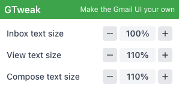

# Gmail UI Tweaker



A simple browser extension that allows you to make the Gmail UI your own. The first features added are the ability to change the text size of the inbox, view, and compose windows.

More features will be added in the future.

## Why I built this

I use large high resolution displays and have a hard time reading the small text in Gmail.

There are various solutions available to fix this, but allowing a third party browser extension to read and modify your Gmail is extremely risky. There have been numerous cases of previously trustworthy extensions being used to steal data. Once you provide those permissions, you don't know what they are doing with your data. I built this extension to customize my Gmail UI without safely running the extension locally.

You can audit the code, download it, and run it locally yourself, safe in the knowledge that your data is not being compromised for the sake of a few UI tweaks.

## Technology Stack

This extension is built using modern web technologies:

- **[WXT](https://wxt.dev/)**: Next-gen framework for building browser extensions
- **TypeScript**: For type-safe code
- **React**: For the popup UI
- **Tailwind CSS 4**: For modern, utility-first styling
- **Manifest V3**: Latest Chrome extension manifest version

## Development

### Prerequisites

- Node.js 18+
- pnpm (or npm/yarn)

### Setup

```bash
# Install dependencies
pnpm install

# Start development mode
pnpm dev

# Build for production
pnpm build

# Create distribution zip
pnpm zip
```

### Project Structure

```
entrypoints/
├── background.ts       # Background service worker
├── content.ts          # Content script for Gmail
└── popup/              # Extension popup (React + Tailwind)
    ├── index.html
    ├── main.tsx
    ├── App.tsx
    └── style.css
lib/
├── storage.ts          # Storage utilities
└── types.ts            # TypeScript types
assets/
└── tailwind.css        # Tailwind CSS 4 entry point
```

## How It Works

1. Click the extension icon in your browser toolbar to open the popup
2. Use the +/- buttons to adjust zoom levels for each area:
   - **Inbox text size** - Zoom the list of emails
   - **View text size** - Zoom individual email content
   - **Compose text size** - Zoom when writing emails
3. Click the percentage value to reset to 100%
4. CSS `zoom` property is applied to Gmail's elements:
   - `.F` for inbox/message list
   - `.ii` for individual messages
   - `.Au` for compose window
5. Settings are automatically saved and persist across browser sessions
6. Changes apply instantly to all open Gmail tabs

## Development Notes

### Content Script Implementation

The content script:

- Loads zoom settings from storage on page load
- Listens for updates from the popup
- Applies CSS zoom property to Gmail's elements
- Simple and lightweight (~45 lines)

### Storage Strategy

Settings are stored using `chrome.storage.local` with the structure:

```typescript
{
  zoomSettings: {
    m: number,  // message zoom
    l: number,  // list zoom
    w: number   // write/compose zoom
  }
}
```

## Building for Production

```bash
# Build for Chrome
pnpm build

# Build for Firefox
pnpm build:firefox

# Create distribution zip
pnpm zip
```

The built extension will be in the `output/` directory.

## Credits

- Original extension concept: V7 Gmail Zoom
- Rebuilt with WXT framework for better maintainability and modern standards
- UI built with React and Tailwind CSS
